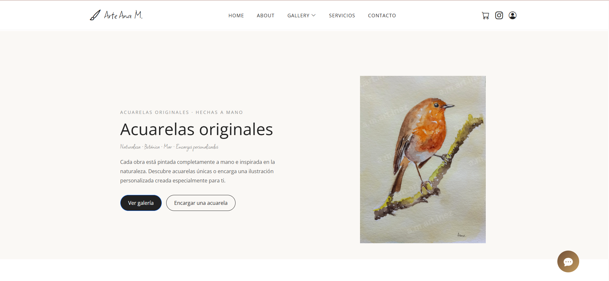

# 🎨 Acuarelasana

<p align="center">
  
</p>

<p align="center">
  <strong>Portfolio web for a professional watercolor artist.</strong>
</p>

<p align="center">
  Built with Angular 21, designed with performance, responsive design and user experience in mind.
</p>

---

## 📖 About the project

**Acuarelasana** is a modern web application developed for a professional watercolor artist to showcase her artwork, provide information about commissions, and offer visitors an intuitive and engaging browsing experience.

The project was designed following modern Angular best practices, focusing on:

- Clean architecture
- Responsive design
- Performance optimization
- Accessibility
- Reusable standalone components
- Smooth animations
- SEO-friendly structure

---

## ✨ Features

- 🎨 Artwork gallery
- 🔍 Lightbox image viewer
- 🖼️ Protected artwork images
- 📱 Fully responsive design
- 💬 Interactive assistant chat
- ❓ FAQ section
- 📩 Contact & commission request form
- 🎭 Custom 404 interactive page
- ⚡ Lazy loading
- 🌙 Modern UI with smooth animations
- 🔒 Firebase Authentication (Admin)
- ☁️ Cloudinary image management
- 📦 Firestore integration

---

## 🛠️ Built With

| Technology | Version |
|------------|----------|
| Angular | 21 |
| TypeScript | Latest |
| SCSS | ✓ |
| Bootstrap Icons | ✓ |
| Firebase | ✓ |
| Firestore | ✓ |
| Cloudinary | ✓ |
| Angular Router | ✓ |
| RxJS | ✓ |

---

## 📂 Project Structure

```

src/
│
├── app/
│   ├── core/
│   ├── features/
│   ├── layouts/
│   ├── shared/
│   └── pages/
│
├── assets/
│
└── environments/

````

---

## 🚀 Getting Started

Clone the repository

```bash
git clone <repository-url>
````

Navigate to the project

```bash
cd acuarelasana
```

Install dependencies

```bash
npm install
```

Start the development server

```bash
ng serve
```

Open your browser at

```
http://localhost:4200
```

---

## 📦 Production Build

```bash
ng build
```

The compiled application will be generated inside:

```
dist/
```

---

## 🧪 Running Tests

Unit tests

```bash
ng test
```

End-to-End tests

```bash
ng e2e
```

---

## 📸 Screenshots

> *(Add screenshots of the Home page, Gallery, Services, Admin panel and Contact page here.)*

Example:

```
docs/
    home.png
    gallery.png
    services.png
```

Then reference them like:

```md

```

---

## 🚀 Future Improvements

* Image search
* Artwork filtering
* Online purchases
* Multi-language support
* User accounts
* Favorites
* Progressive Web App (PWA)

---

## 👨‍💻 Author

**Amado Melguizo Martínez**

Frontend Software Engineer

* Angular
* TypeScript
* Java
* Spring Boot

---

## ⭐ If you like this project

Give it a ⭐ on GitHub!

For more information on using the Angular CLI, including detailed command references, visit the [Angular CLI Overview and Command Reference](https://angular.dev/tools/cli) page.

Cambio del readme y prueba del copilot
It helps support the project and motivates future improvements.
